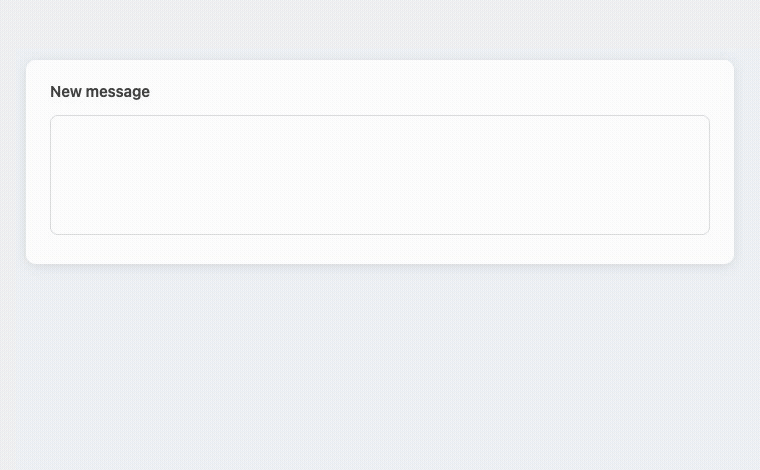

# Inline Reformat

[](https://github.com/odafeng/inline-reformat/actions/workflows/ci.yml) [](LICENSE)

Press `Alt+R`, and the paragraph you are typing comes back as fluent English in a small card under the input box. Press `Tab` to accept it, `Esc` to dismiss, or just keep typing and it gets out of your way. No text selection, no right-click menu, no leaving the field. (Prefer suggestions to appear on their own after a typing pause? That mode is one checkbox away in Options.)

[繁體中文說明](README.zh-TW.md)



Built for people who write English as a second language all day (emails, papers, code review comments) and are tired of the copy-into-ChatGPT-paste-back loop.

## Bring your own key

There is no server behind this extension and no account to create. You plug in your own API key, and every request goes straight from your browser to the endpoint you configured. No one else sees your text, and nothing is logged.

- The key lives in `chrome.storage.local`. It never syncs to other machines and never leaves your browser.
- Works with an Anthropic key out of the box, or with any OpenAI-compatible endpoint: Ollama or vLLM on your own hardware, LM Studio, OpenRouter.
- Point it at a local model and your text never leaves your machine at all. This is the setup I use for anything confidential.
- The whole extension is about 600 lines of plain JavaScript with no build step and no bundled dependencies. You can read every line that touches your key before you paste it in.

## Why a suggestion card instead of auto-replace

Every tool in this space eventually faces the same choice: rewrite the user's text automatically, or show a suggestion and wait. This one deliberately waits.

An LLM rewrite occasionally shifts meaning. If English isn't your first language, you are exactly the person least likely to notice a flipped negation in your own outgoing email. The accept keystroke keeps one pair of human eyes on every change. It also makes the extension safe with IMEs: your input field is never touched until you press Tab, so typing Chinese, Japanese, or Korean mid-sentence can't corrupt the composition buffer. And because replacement goes through the browser's native editing command, `Cmd+Z` undoes an accepted suggestion like any other edit.

The reasoning is written up in [docs/adr/0001](docs/adr/0001-ghost-suggestion-interaction-model.md).

## Install

Not on the Chrome Web Store yet. From source:

1. Clone this repo
2. Open `chrome://extensions`, enable **Developer mode**
3. Click **Load unpacked** and pick the `src/` folder
4. Right-click the extension icon → **Options**, choose a backend, paste a key

## Backends

| Provider            | Notes                                                                                                                                                                               |
| ------------------- | ----------------------------------------------------------------------------------------------------------------------------------------------------------------------------------- |
| Anthropic (default) | Uses `claude-haiku-4-5`. A rewrite costs a fraction of a cent; heavy daily use lands around a few cents per day.                                                                    |
| OpenAI-compatible   | Any endpoint speaking `/v1/chat/completions`, streaming included. Enter the base URL (with `/v1`) and the extension asks for permission to reach that origin, and only that origin. |

## Make it write like you

The system prompt is editable in Options and applies immediately. The default asks for a faithful rewrite: keep the meaning, keep the register, keep line breaks, return the text unchanged if it is already fine. If you want your emails warmer or your manuscripts more formal, say so there. That one text box is most of the product.

## When it triggers, and when it deliberately doesn't

By default, only when you ask: `Alt+R` rewrites the paragraph under the caret. One keystroke, one API call — nothing is ever sent while you just type.

If you enable the optional auto-trigger in Options, a request also fires after a typing pause — but only after all of these pass:

- you stopped typing for 1.5 s (configurable)
- the paragraph under your caret is at least 15 characters and 4 words
- the text is mostly English; CJK input never triggers and never costs you a request
- you are not mid-composition in an IME
- the same paragraph wasn't already suggested, accepted, or dismissed
- the site isn't on your blocklist

Typing again cancels the in-flight request. Errors are silent by design; a broken key or a dead endpoint should never interrupt your writing.

To keep all of this legible:

- The card echoes the original paragraph it is rewriting, and in rich-text editors the paragraph itself gets a subtle outline — you always see exactly what was sent (and only that paragraph is ever sent).
- If the model thinks your text is already fine, the card flashes a brief ✓ instead of silently not appearing.
- `Alt+R` always works: it skips every condition above — including the English check, the blocklist, and the master switch.
- If a suggestion you expected never came, enable "Log every trigger decision" in Options and the reason shows up in the page's DevTools console.

## Known limitations

- Google Docs doesn't work. It renders text on a canvas, so no extension of this kind can reach it.
- Code-editor components (CodeMirror and Monaco, which includes the Overleaf editor) aren't supported yet.
- English output only. That's the scope, not a bug.

## Development

```bash
npm install
npm test          # vitest unit tests for the pure logic
npm run smoke     # Playwright: loads the real extension against a mock LLM endpoint
npm run lint
```

The design spec lives in [docs/superpowers/specs/](docs/superpowers/specs/), and the two decisions worth reading are in [docs/adr/](docs/adr/). Pre-commit hooks: `git config core.hooksPath .githooks`.

## Privacy

No server, no analytics, no logging. The paragraph being rewritten goes only to the endpoint you configured. Details in [PRIVACY.md](PRIVACY.md).

## License

[MIT](LICENSE)
