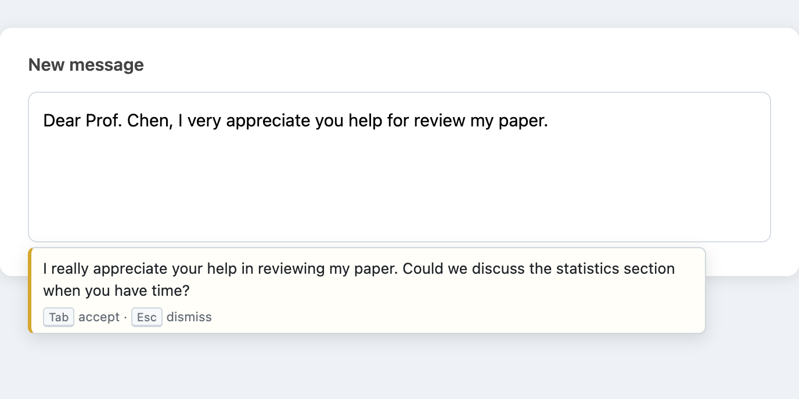

# Inline Reformat

打字停頓 1.5 秒，你剛打的那段英文會被改寫成通順版本，出現在輸入框下方的小卡片裡。按 `Tab` 接受、`Esc` 關閉、繼續打字就自動消失。不用反白、不用右鍵、不用離開輸入框。

[English README](README.md)



做給整天要用英文寫信、寫論文、回 review 的非母語者。目標是取代「複製到 ChatGPT 再貼回來」那個循環。

## 自備 API key（BYOK）

沒有伺服器、不用註冊帳號、沒有任何遙測。你填自己的 key，每個請求直接從瀏覽器發到你設定的那一個端點，其他人碰不到你的文字。

- key 存在 `chrome.storage.local`，不同步到其他機器，也不離開這台瀏覽器
- 預設接 Anthropic，也可以接任何 OpenAI-compatible 端點：自己機器上的 Ollama / vLLM、LM Studio、OpenRouter
- 接本地模型的話，文字完全不出你的機器。涉及機密內容我自己就是這樣用
- 全部約 500 行純 JavaScript、零 build step。貼 key 之前，每一行會碰到 key 的程式碼你都讀得完

## 為什麼是建議卡片，不是自動取代

這類工具遲早要選邊：自動改掉你的字，還是顯示建議等你點頭。這個專案刻意選後者。

LLM 改寫偶爾會動到語意。英文非母語的人，恰好最不容易發現自己信裡被反轉的否定詞，所以每個變更都要過你的眼睛才落地。這個設計同時對 IME 安全：按 Tab 之前輸入框完全不被碰，中文組字打到一半不會被撕裂。取代走瀏覽器原生編輯指令，接受後 `Cmd+Z` 隨時反悔。

完整理由在 [docs/adr/0001](docs/adr/0001-ghost-suggestion-interaction-model.md)。

## 安裝

還沒上 Chrome Web Store。從原始碼裝：

1. Clone 這個 repo
2. `chrome://extensions` → 開「開發人員模式」
3. 「載入未封裝項目」→ 選 `src/` 資料夾
4. 右鍵擴充功能圖示 → 選項 → 選後端、貼 key

## 後端

| Provider          | 說明                                                                                            |
| ----------------- | ----------------------------------------------------------------------------------------------- |
| Anthropic（預設） | 用 `claude-haiku-4-5`，一次改寫不到 0.1 美分，整天重度使用大約幾美分                            |
| OpenAI-compatible | 任何講 `/v1/chat/completions` 的端點。填 base URL（含 `/v1`），擴充功能只會請求那一個網域的權限 |

## 改成你的語感

System prompt 在選項頁直接編輯，存檔立即生效。預設要求忠實改寫：保留語意、保留 register、保留換行，已經通順就原樣返回。想要信件更溫暖或論文更正式，就寫在那裡。那個文字框就是這個產品的大半。

## 什麼時候觸發、什麼時候刻意不觸發

以下條件全過才會發請求：

- 停止打字 1.5 秒（可調）
- 游標所在段落 ≥ 15 字元、≥ 4 個單字
- 內容主要是英文——打中文不觸發、也不燒你的 API
- 不在 IME 組字中
- 同一段落沒有被建議過、接受過、關閉過
- 該網站不在你的停用清單

繼續打字就取消進行中的請求。錯誤一律靜默：key 失效或端點掛掉，都不該打斷你寫作。

## 已知限制

- Google Docs 不支援（canvas 渲染，所有同類擴充功能都做不到）
- 程式碼編輯器元件（CodeMirror、Monaco，例如 Overleaf 編輯器）尚未支援
- 只輸出英文。這是範圍設定，不是 bug

## 開發

```bash
npm install
npm test          # vitest 單元測試（純函式邏輯）
npm run smoke     # Playwright：真實載入擴充功能 + mock LLM 端點
npm run lint
```

設計 spec 在 [docs/superpowers/specs/](docs/superpowers/specs/)，兩個關鍵決策在 [docs/adr/](docs/adr/)。Pre-commit hook：`git config core.hooksPath .githooks`。

## 授權

[MIT](LICENSE)
